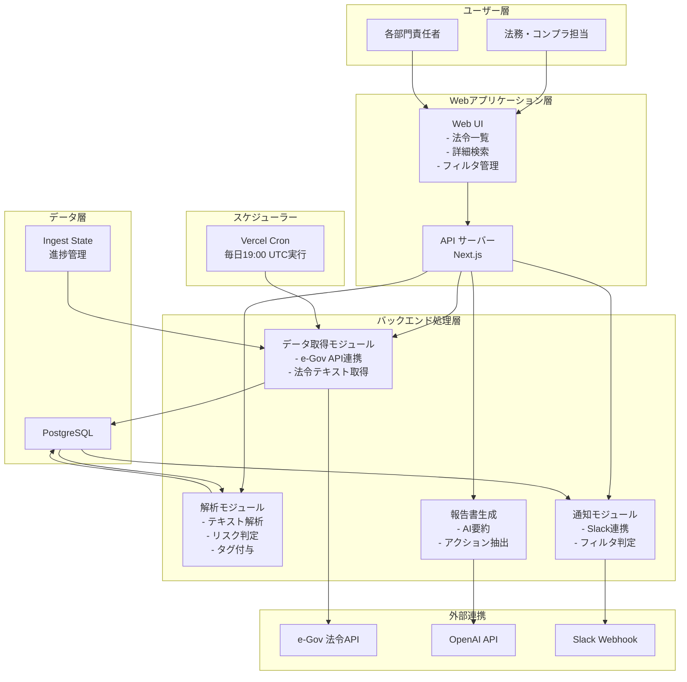
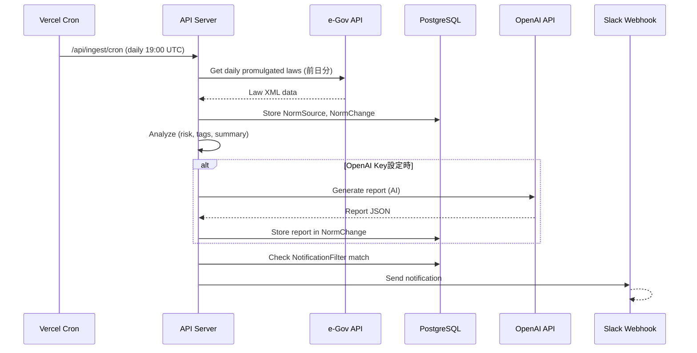

# 法令インパクト管理システム - システム全体概要

## 1. プロジェクト概要

### 目的
法令・省令・政令・ガイドライン等の公示情報から、企業や組織にとって重要な「誰向けに／何がどう変わり／何をしないといけないか」を自動的に抽出・分析し、Web UI および Slack を通じてステークホルダーに通知するシステムです。

### 主要ユースケース
1. **法令情報の自動監視**: e-Gov法令APIから毎日の法令公示情報を自動取得
2. **インパクト解析**: 取得した法令からビジネス影響度、リスク分類を自動分析
3. **ユーザーカスタマイズ**: ユーザーが関心領域（業界、機能、データ種別）をフィルタリング
4. **マルチチャネル通知**: Web UI および Slack での通知
5. **報告書生成**: AI（OpenAI）を活用した詳細レポート自動生成（オプション）

---

## 2. 技術スタック

### フロントエンド
- **フレームワーク**: Next.js 16.1.6 (React 19.2.3)
- **言語**: TypeScript 5
- **スタイリング**: Tailwind CSS 4
- **ページ構成**: App Router（Next.js 13+）

### バックエンド
- **ランタイム**: Node.js (Next.js API Routes)
- **言語**: TypeScript
- **ORM**: Prisma 7.4.0
- **データベース**: PostgreSQL (Neon / Supabase)

### 外部連携
- **API**: e-Gov法令API, OpenAI API, Slack Webhook
- **ファイル処理**: adm-zip, iconv-lite, fast-xml-parser

### 開発環境
- **テスト**: Vitest 4.0.18
- **リンター**: ESLint 9
- **スクリプト実行**: tsx 4.19.2
- **デプロイ**: Vercel (CI/CD自動化)

---

## 3. システム構成図



---

## 4. コアビジネスロジック

### 4.1 三つのリスク分類
法令変更に伴うリスク・インパクトを以下に分類：

| リスク分類 | 定義 | 具体例 |
|-----------|------|--------|
| **生存リスク** (`riskSurvival`) | 業務停止・許認可取消などの営業継続性の脅威 | 業務停止命令、免許取消 |
| **金銭リスク** (`riskFinancial`) | 罰金・課徴金・追徴課税など直接的な金銭ペナルティ | 罰金、課徴金、追徴課税 |
| **信用リスク** (`riskCredit`) | 社名公表・勧告など企業イメージへの影響 | 社名公表、改善勧告 |
| **その他リスク** (`riskOther`) | 上記3分類に当てはまらない手続き変更など | 手続き変更、様式改訂 |

### 4.2 法令種別分類
取得する法令の種別：
- `LAW` - 法律
- `ORDINANCE` - 政令
- `REGULATION` - 省令
- `GUIDELINE` - ガイドライン・指針
- `NOTICE` - 告示・通知
- `OTHER` - その他

### 4.3 タグシステム
ユーザーフィルタリングとマッチングに使用：

| タグタイプ | 例 |
|-----------|-----|
| `INDUSTRY` | 金融, 製造, 医療, IT |
| `BUSINESS_SIZE` | 大企業, 中小企業 |
| `FUNCTION` | 人事, 情報システム, 財務 |
| `DATA_TYPE` | 個人情報, 機密情報, クレジット情報 |
| `RISK_LEVEL` | High, Medium, Low |
| `OTHER` | その他カスタムタグ |

---

## 5. データフロー（概要）



---

## 6. 主要な処理フロー

### 6.1 データ取得フロー（Ingest）
1. **スケジュール**: Vercel Cron が毎日 19:00 UTC に `/api/ingest/cron` を呼び出す
2. **前日分取得**: e-Gov 法令API から前日の公示法令をダウンロード
3. **パース**: XML を解析して NormSource レコードを作成
4. **正規化**: 改正前後のテキストを取得し、データベースに保存
5. **進捗管理**: IngestState で最終成功日付を更新

### 6.2 解析フロー（Analyze）
1. **テキスト抽出**: NormSource から本文・改正点を抽出
2. **キーワードマッチング**: リスク関連キーワードをスキャン
3. **リスク判定**: キーワード出現に基づいて riskSurvival/Financial/Credit を判定
4. **詳細抽出**: ペナルティ詳細 (penaltyDetail) を抽出
5. **タグ付与**: ビジネス影響度からタグを自動付与
6. **レポート生成（オプション）**: OpenAI で詳細レポートを生成
7. **NormChange 作成**: 解析結果を保存

### 6.3 通知フロー（Notification）
1. **フィルタ条件評価**: 新規 NormChange が NotificationFilter の条件に一致するか判定
2. **Slack 送信**: 条件一致時に Slack Webhook で通知
3. **Web UI 表示**: 全ユーザーに Web UI で表示可能

---

## 7. ユーザーペルソナと主要機能マッピング

| ペルソナ | 主要な関心事 | 使用機能 |
|---------|-----------|---------|
| **法務・コンプラ** | 全ての法令変更 | 検索・詳細閲覧・タグフィルタ・レポート出力 |
| **人事部長** | 労働法・給与関連 | Slack通知・Web UI・関連法令の流れを把握 |
| **情報システム** | 個人情報保護法・サイバーセキュリティ関連 | Slack通知・Web UI・影響度分析 |
| **財務部** | 税務・会計関連法令 | Web UI・レポート機能 |

---

## 8. 環境構成

### 8.1 ローカル開発環境
```
Next.js dev server: localhost:3000
Database: PostgreSQL (localhost or Docker)
Slack: 開発用Webhook (テスト用チャネル)
```

### 8.2 開発環境（Vercel Dev）
```
Deployment: dev ブランチ自動デプロイ
Database: Neon Dev インスタンス
Slack: #legal-dev チャネル
```

### 8.3 本番環境（Vercel Prod）
```
Deployment: main ブランチ自動デプロイ
Database: Neon Prod インスタンス (バックアップ有効)
Slack: #legal-alerts チャネル
Cron: 毎日 19:00 UTC
```

---

## 9. 次のドキュメント

- **[詳細アーキテクチャ](02-DETAILED_ARCHITECTURE.md)** - コンポーネント/モジュール詳細
- **[実装設計](03-IMPLEMENTATION_DESIGN.md)** - 各モジュールの詳細仕様
- **[データフロー詳細](04-DATAFLOW_DETAILED.md)** - 全データフロー図
- **[API仕様書](05-API_SPECIFICATION.md)** - エンドポイント一覧と仕様

---

**最終更新**: 2026-03-03
**対象バージョン**: v0.1.0
