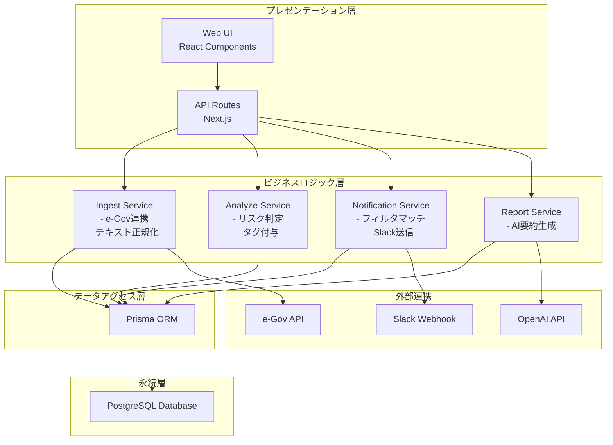
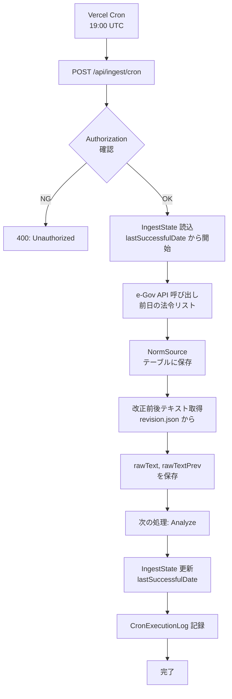
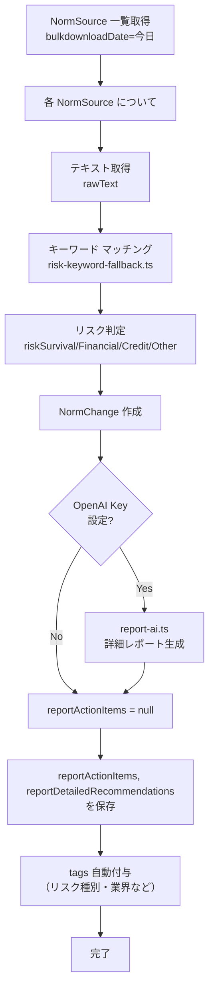
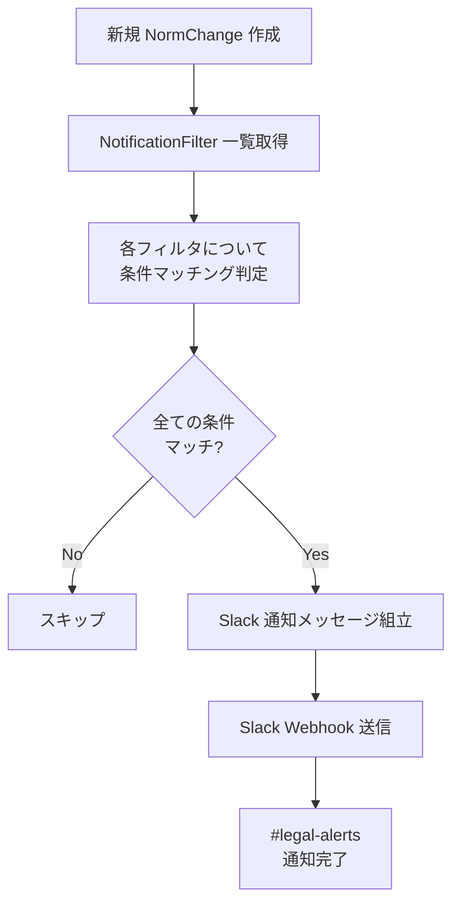
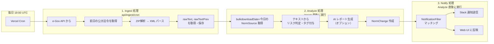

# 法令インパクト管理システム - 詳細アーキテクチャ

## 1. レイヤー構成



---

## 2. コンポーネント分解

### 2.1 フロントエンド層 (`src/app`)

#### ページコンポーネント

```
src/app/
├── page.tsx                           # ダッシュボード
├── layout.tsx                         # レイアウト（全ページ共通）
├── norm-changes/
│   ├── page.tsx                       # 法令変更一覧
│   ├── [id]/page.tsx                  # 法令変更詳細
│   └── layout.tsx                     # norm-changes専用レイアウト
├── settings/
│   └── page.tsx                       # ユーザー設定（フィルタ管理）
└── about/
    └── page.tsx                       # 動作説明ページ
```

##### 主要ページの責務

| ページ | 役割 | 表示内容 |
|--------|------|---------|
| `/` | ダッシュボード | 最新の法令変更一覧・統計 |
| `/norm-changes` | 法令変更一覧 | 検索・フィルタリング・ページネーション |
| `/norm-changes/[id]` | 詳細表示 | 本文・解析結果・レポート・アクション |
| `/settings` | ユーザー設定 | フィルタ定義・Slack通知設定 |
| `/about` | 説明ページ | 利用方法・用語説明 |

#### API Routes (`src/app/api`)

```
src/app/api/
├── norm-changes/
│   ├── route.ts                       # GET: 法令変更一覧 (検索対応)
│   └── [id]/route.ts                  # GET: 詳細取得
├── ingest/
│   ├── laws/route.ts                  # POST: 手動実行（日付指定）
│   ├── cron/route.ts                  # POST: Cron自動実行
│   ├── cron-logs/route.ts             # GET: Cron実行ログ
│   └── state/route.ts                 # GET: ingest状態確認
├── analyze/
│   └── route.ts                       # POST: 解析手動実行
├── notification-filters/
│   ├── route.ts                       # GET/POST: フィルタCRUD
│   └── [id]/route.ts                  # GET/PUT/DELETE: フィルタ詳細
├── slack-config/
│   └── route.ts                       # POST: Slack設定更新
├── openai-usage/
│   └── route.ts                       # GET: OpenAI API使用量確認
├── db-health/
│   └── route.ts                       # GET: DB接続確認
└── debug-openai-env/
    └── route.ts                       # GET: OpenAI環境確認（デバッグ用）
```

##### API エンドポイント概要

| メソッド | パス | 説明 |
|---------|------|------|
| `GET` | `/api/norm-changes` | 法令変更一覧 (クエリ: `q`, `tags`, `risk`) |
| `GET` | `/api/norm-changes/[id]` | 詳細取得 |
| `POST` | `/api/ingest/laws` | 手動取得 (クエリ: `date`) |
| `POST` | `/api/ingest/cron` | Cron自動実行 (Header: `Authorization`) |
| `GET` | `/api/ingest/state` | Ingest状態 |
| `POST` | `/api/analyze` | 手動解析 |
| `GET/POST` | `/api/notification-filters` | フィルタ管理 |

### 2.2 ビジネスロジック層 (`src/lib`)

#### コア処理モジュール

```
src/lib/
├── egov-api.ts                        # e-Gov API連携
├── egov-revisions.ts                  # テキスト改正部抽出
├── bulkdownload.ts                    # ZIP展開・XML解析
├── ingest-laws.ts                     # 法令取得・正規化
├── ingest-state.ts                    # 進捗状態管理
├── analyze.ts                         # テキスト解析
├── risk-keyword-fallback.ts           # リスク判定ロジック
├── report-ai.ts                       # AI レポート生成
├── run-analyze.ts                     # 解析実行制御
├── notification-filter-match.ts       # フィルタマッチング
├── slack.ts                           # Slack 通知
├── risk-display.ts                    # リスク表示ロジック
├── norm-types.ts                      # 型定義
├── prisma.ts                          # Prisma インスタンス
├── db-timeout.ts                      # DB タイムアウト設定
└── test files
    ├── bulkdownload.test.ts
    ├── egov-revisions.test.ts
    └── ...
```

#### モジュール詳細

| モジュール | 入力 | 出力 | 責務 |
|-----------|------|------|------|
| `egov-api.ts` | 日付 | XML/ZIP | e-Gov API からデータ取得 |
| `bulkdownload.ts` | ZIP | XML Parser | ZIP 展開・XML 解析 |
| `ingest-laws.ts` | XMLデータ | NormSource/NormChange | DB保存用にパース・正規化 |
| `analyze.ts` | NormSource テキスト | リスク判定・タグ | テキスト解析 |
| `risk-keyword-fallback.ts` | テキスト | リスク分類 | キーワード マッチング |
| `report-ai.ts` | テキスト, OpenAI Key | レポート JSON | AI報告書生成 |
| `slack.ts` | メッセージ | HTTP POST | Slack通知 |

### 2.3 データアクセス層

#### Prisma ORM スキーマ (`prisma/schema.prisma`)

主要モデル：

```typescript
// 法令一次情報
model NormSource {
  id, externalId, type, title, number, publisher,
  publishedAt, effectiveAt, url,
  rawText, rawTextPrev,
  bulkdownloadDate,
  createdAt, updatedAt
  → changes: NormChange[]
}

// 実務的「変更点」
model NormChange {
  id, normSourceId, summary, penaltyDetail,
  riskSurvival, riskFinancial, riskCredit, riskOther,
  effectiveFrom,
  reportActionItems, reportDetailedRecommendations,
  createdAt, updatedAt
  → normSource: NormSource
  → tags: NormChangeTag[]
}

// タグ
model Tag {
  id, type (INDUSTRY|BUSINESS_SIZE|FUNCTION|DATA_TYPE|RISK_LEVEL|OTHER),
  key, labelJa, description,
  createdAt, updatedAt
  → normChanges: NormChangeTag[]
}

// 多対多中間テーブル
model NormChangeTag {
  id, normChangeId, tagId, createdAt
  @@unique([normChangeId, tagId])
}

// ユーザー
model User {
  id, name, email, slackUserId,
  createdAt, updatedAt
  → filters: UserFilter[]
}

// ユーザーフィルタ
model UserFilter {
  id, userId, name,
  includeTagIds (JSON array),
  excludeTagIds (JSON array),
  createdAt, updatedAt
}

// Slack 通知フィルタ
model NotificationFilter {
  id, name,
  publishedFrom, publishedTo,
  riskSurvival, riskFinancial, riskCredit, riskOther,
  normType, tagId,
  createdAt, updatedAt
}

// Cron 実行ログ
model CronExecutionLog {
  id, startedAt, endedAt, result,
  processedDates (JSON array),
  errorMessage, durationMs
}

// Ingest 進捗状態
model IngestState {
  id ("default"),
  lastSuccessfulDate (yyyyMMdd),
  updatedAt
}
```

---

## 3. データフロー詳細

### 3.1 Ingest フロー（毎日自動実行）



### 3.2 Analyze フロー（Ingest直後）



### 3.3 Notify フロー（Web + Slack）

**Web UI での表示:**
- 新規 NormChange → `/norm-changes` で表示
- ユーザーが UserFilter で絞込

**Slack での通知:**


---

## 4. 処理フロー統合図



---

## 5. 外部連携

### 5.1 e-Gov API
- **エンドポイント**: `https://www.e-gov.go.jp/api/1/laws`
- **パラメータ**: `date=YYYYMMDD` （公示日）
- **レスポンス**: XML (ZIP) または JSON
- **制限**: 頻繁なアクセス制御あり（要確認）

### 5.2 OpenAI API
- **エンドポイント**: `https://api.openai.com/v1/chat/completions`
- **モデル**: gpt-4o-mini
- **用途**: 法令インパクトの詳細レポート生成
- **入力**: 法令テキスト、改正点
- **出力**: JSON (actionItems[], detailedRecommendations[])

### 5.3 Slack Webhook
- **エンドポイント**: 環境変数 `SLACK_WEBHOOK_URL`
- **メソッド**: POST
- **ペイロード**: メッセージブロック (text, risk icon, tags)

---

## 6. セキュリティ考慮事項

### 6.1 認証・認可
- **Cron エンドポイント**: `CRON_SECRET` での Bearer Token 認証
- **API Routes**: 公開（認証なし）- 本番では要検討
- **データベース**: Prisma のクエリ時に SQL Injection 対策済み

### 6.2 環境変数管理
- `.env.local` (開発) / `.env.production` (本番) に機密情報を管理
- Git には含めない（`.gitignore` で除外）
- Vercel では Environment Variables で管理

### 6.3 API キー保護
- `OPENAI_API_KEY`: 環境変数のみで管理（ログに出力しない）
- `CRON_SECRET`: Authorization ヘッダーで検証
- `SLACK_WEBHOOK_URL`: 環境変数で管理

---

## 7. 拡張ポイント

| 拡張内容 | 影響範囲 | 難易度 |
|----------|---------|--------|
| ユーザー認証の追加 | API Routes, Web UI | 中 |
| 複数言語対応 | UI, データベース | 中 |
| メール通知機能 | Notify Service, API | 低 |
| データベース複製 | インフラ, 環境設定 | 高 |
| モバイルアプリ化 | API (REST/GraphQL化) | 高 |

---

**最終更新**: 2026-03-03
**対象バージョン**: v0.1.0
