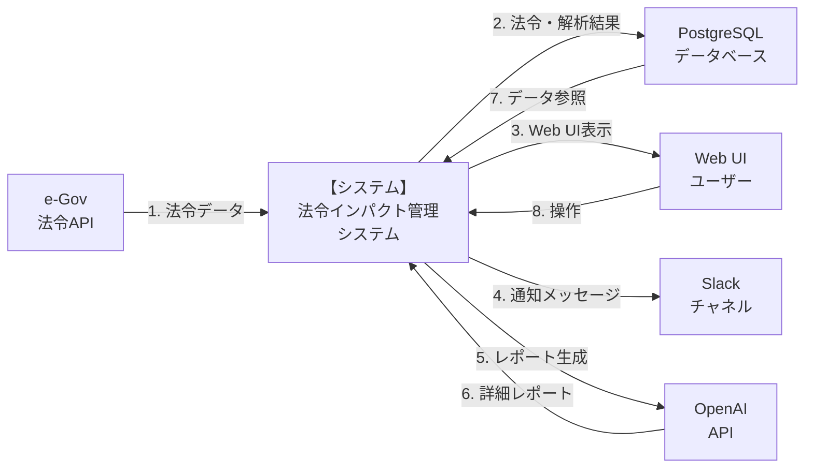
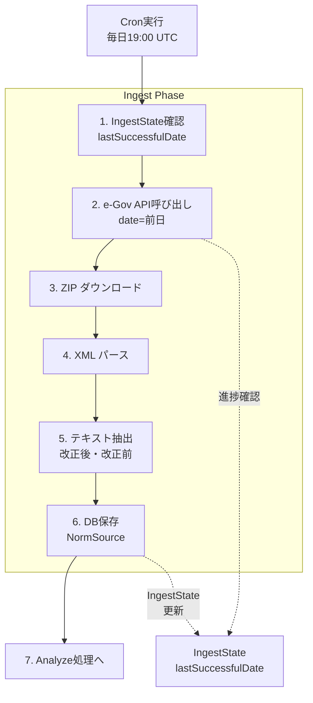
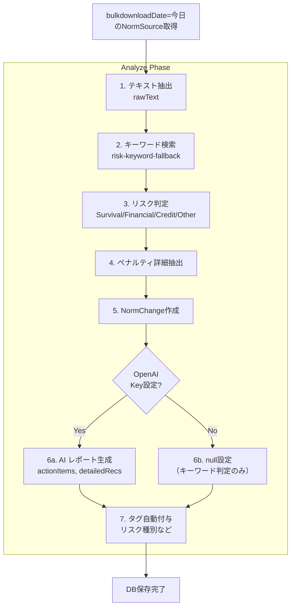
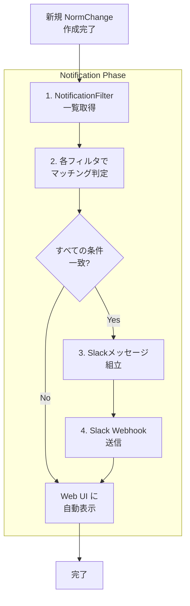
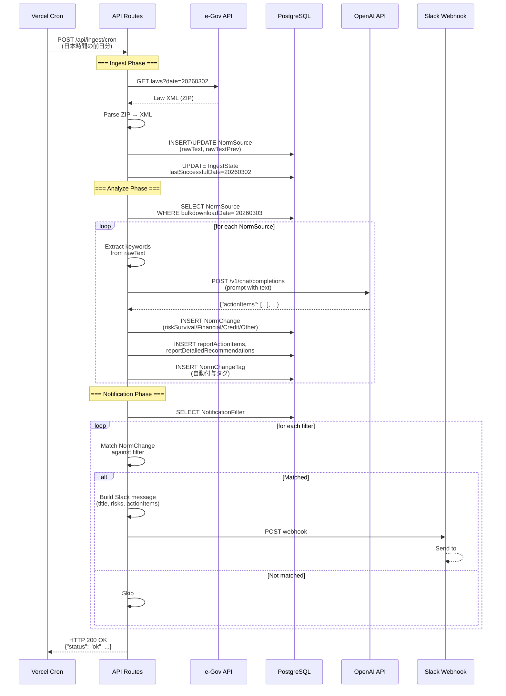

# 法令インパクト管理システム - データモデル・ERD・DFD

## 1. エンティティ関連図（ER図）

### 1.1 概要 ER 図

```mermaid
erDiagram
    NORM_SOURCE ||--o{ NORM_CHANGE : has
    NORM_CHANGE ||--o{ NORM_CHANGE_TAG : tagged_with
    TAG ||--o{ NORM_CHANGE_TAG : used_in
    USER ||--o{ USER_FILTER : defines
    NOTIFICATION_FILTER ||--o{ TAG : uses_optional
    CRON_EXECUTION_LOG ||--|| INGEST_STATE : updates

    NORM_SOURCE {
        string id PK
        string externalId UK "e-Gov lawId"
        string type "LAW|ORDINANCE|REGULATION|GUIDELINE|NOTICE|OTHER"
        string title
        string number "法令番号"
        string publisher "所管省庁"
        datetime publishedAt "公示日"
        datetime effectiveAt "施行日"
        string url "法令URL"
        text rawText "改正後全文"
        text rawTextPrev "改正前全文"
        string bulkdownloadDate "yyyyMMdd"
        datetime createdAt
        datetime updatedAt
    }

    NORM_CHANGE {
        string id PK
        string normSourceId FK
        text summary "要約"
        text penaltyDetail "ペナルティ詳細"
        boolean riskSurvival
        boolean riskFinancial
        boolean riskCredit
        boolean riskOther
        datetime effectiveFrom "発効日"
        json reportActionItems "AI生成"
        json reportDetailedRecommendations "AI生成"
        datetime createdAt
        datetime updatedAt
    }

    TAG {
        string id PK
        string type "INDUSTRY|BUSINESS_SIZE|FUNCTION|DATA_TYPE|RISK_LEVEL|OTHER"
        string key UK "内部キー"
        string labelJa "表示名"
        text description
        datetime createdAt
        datetime updatedAt
    }

    NORM_CHANGE_TAG {
        string id PK
        string normChangeId FK
        string tagId FK
        datetime createdAt
        unique "[normChangeId, tagId]"
    }

    USER {
        string id PK
        string name
        string email
        string slackUserId
        datetime createdAt
        datetime updatedAt
    }

    USER_FILTER {
        string id PK
        string userId FK
        string name "フィルタ名"
        text includeTagIds "JSON array"
        text excludeTagIds "JSON array (optional)"
        datetime createdAt
        datetime updatedAt
        index "[userId]"
    }

    NOTIFICATION_FILTER {
        string id PK
        string name "フィルタ名"
        datetime publishedFrom "公示日From (optional)"
        datetime publishedTo "公示日To (optional)"
        boolean riskSurvival
        boolean riskFinancial
        boolean riskCredit
        boolean riskOther
        string normType "法令種別 (optional)"
        string tagId FK "タグ指定 (optional)"
        datetime createdAt
        datetime updatedAt
        index "[createdAt]"
    }

    CRON_EXECUTION_LOG {
        string id PK
        datetime startedAt
        datetime endedAt "null if not completed"
        string result "ok|error|aborted"
        json processedDates "yyyyMMdd[]"
        text errorMessage
        integer durationMs
        index "[startedAt]"
    }

    INGEST_STATE {
        string id PK "fixed: 'default'"
        string lastSuccessfulDate "yyyyMMdd | null"
        datetime updatedAt
    }
```

### 1.2 詳細説明

#### NORM_SOURCE (法令原本)
**役割**: e-Gov API から取得した法令・省令・ガイドラインなどの一次情報を保持

| 列 | 型 | 説明 | 制約 |
|----|----|----|------|
| `id` | string | 主キー | PRIMARY KEY |
| `externalId` | string | e-Gov lawId | UNIQUE (重複登録防止) |
| `type` | string | 法令種別 | LAW\|ORDINANCE\|REGULATION\|GUIDELINE\|NOTICE\|OTHER |
| `title` | string | 法令名 | NOT NULL |
| `number` | string | 法令番号 | OPTIONAL (例: "令和5年法律第35号") |
| `publisher` | string | 所管省庁 | OPTIONAL |
| `publishedAt` | datetime | 公示日 | NOT NULL |
| `effectiveAt` | datetime | 施行日 | OPTIONAL |
| `url` | string | 公式URL | OPTIONAL |
| `rawText` | text | 改正後全文 | OPTIONAL (Issue #24) |
| `rawTextPrev` | text | 改正前全文 | OPTIONAL (Issue #25) |
| `bulkdownloadDate` | string | yyyyMMdd形式の取得日 | OPTIONAL (Issue #50) |

**インデックス:**
- `externalId` (UNIQUE)
- `bulkdownloadDate` (Analyze用)
- `publishedAt` (ソート用)

---

#### NORM_CHANGE (実務的な変更点・対応論点)
**役割**: NormSourceから抽出された「誰向け・何が変わるか・何をすべきか」の実務レベルの情報

| 列 | 型 | 説明 | 制約 |
|----|----|----|------|
| `id` | string | 主キー | PRIMARY KEY |
| `normSourceId` | string | 外キー | FK → NORM_SOURCE, CASCADE |
| `summary` | text | 変更点の要約 | NOT NULL |
| `penaltyDetail` | text | ペナルティ詳細文 | OPTIONAL (リスク有時) |
| `riskSurvival` | boolean | 生存リスク | DEFAULT: false |
| `riskFinancial` | boolean | 金銭リスク | DEFAULT: false |
| `riskCredit` | boolean | 信用リスク | DEFAULT: false |
| `riskOther` | boolean | その他リスク | DEFAULT: false |
| `effectiveFrom` | datetime | 対応期限 | OPTIONAL |
| `reportActionItems` | json | AI生成アクション | OPTIONAL, string[] |
| `reportDetailedRecommendations` | json | AI生成詳細レコメ | OPTIONAL, {action, basis}[] |

**インデックス:**
- `normSourceId` (FK)
- `createdAt` (最新順)

---

#### TAG (業界・機能領域などの分類タグ)
**役割**: マルチテナント的に複数のタグシステムを提供

| 列 | 型 | 説明 | 制約 |
|----|----|----|------|
| `id` | string | 主キー | PRIMARY KEY |
| `type` | string | タグカテゴリ | INDUSTRY\|BUSINESS_SIZE\|FUNCTION\|DATA_TYPE\|RISK_LEVEL\|OTHER |
| `key` | string | 内部識別キー | UNIQUE (例: "finance", "hr") |
| `labelJa` | string | 日本語表示名 | NOT NULL |
| `description` | text | 説明 | OPTIONAL |

**事前定義タグ例:**

```
[INDUSTRY]
- key: finance, label: 金融
- key: manufacturing, label: 製造
- key: healthcare, label: 医療
- key: it, label: IT

[BUSINESS_SIZE]
- key: large, label: 大企業
- key: medium, label: 中堅企業
- key: small, label: 中小企業

[FUNCTION]
- key: hr, label: 人事
- key: it, label: 情報システム
- key: compliance, label: コンプライアンス
- key: finance, label: 財務

[DATA_TYPE]
- key: personal_info, label: 個人情報
- key: credit_info, label: クレジット情報
- key: health_info, label: 健康情報

[RISK_LEVEL]
- key: high, label: High
- key: medium, label: Medium
- key: low, label: Low
```

---

#### NORM_CHANGE_TAG (多対多中間テーブル)
**役割**: NormChange と Tag の多対多関係を管理

| 列 | 型 | 説明 | 制約 |
|----|----|----|------|
| `id` | string | 主キー | PRIMARY KEY |
| `normChangeId` | string | 外キー | FK → NORM_CHANGE, CASCADE |
| `tagId` | string | 外キー | FK → TAG |

**制約:**
- UNIQUE([normChangeId, tagId]) - 同じタグが複数回付与されない
- INDEX([normChangeId], [tagId]) - 検索最適化

---

#### USER (利用者)
**役割**: Web UI / Slack 通知の受信者

| 列 | 型 | 説明 | 制約 |
|----|----|----|------|
| `id` | string | 主キー | PRIMARY KEY |
| `name` | string | 名前 | OPTIONAL |
| `email` | string | メールアドレス | OPTIONAL |
| `slackUserId` | string | Slack ユーザーID | OPTIONAL |

**用途:**
- 現在は「フィルタ定義」用途が主
- 将来のユーザー認証機能の基盤

---

#### USER_FILTER (ユーザーごとのフィルタ)
**役割**: 各ユーザーが Web UI で表示する NormChange をフィルタリング

| 列 | 型 | 説明 | 制約 |
|----|----|----|------|
| `id` | string | 主キー | PRIMARY KEY |
| `userId` | string | 外キー | FK → USER, CASCADE |
| `name` | string | フィルタ名 | NOT NULL (例: "自分用", "人事部向け") |
| `includeTagIds` | text | JSON array | 含める tag.id リスト |
| `excludeTagIds` | text | JSON array | 除外する tag.id リスト (OPTIONAL) |

**使用例:**
```json
{
  "id": "filter-001",
  "userId": "user-001",
  "name": "人事部向け",
  "includeTagIds": "[\"tag-hr\", \"tag-large-enterprise\"]",
  "excludeTagIds": "[\"tag-low-risk\"]"
}
```

---

#### NOTIFICATION_FILTER (Slack 通知フィルタ)
**役割**: 新規 NormChange が Slack で通知される条件を定義

| 列 | 型 | 説明 | 制約 |
|----|----|----|------|
| `id` | string | 主キー | PRIMARY KEY |
| `name` | string | フィルタ名 | NOT NULL (例: "生存リスクのみ") |
| `publishedFrom` | datetime | 公示日 From | OPTIONAL (null = 条件に含めない) |
| `publishedTo` | datetime | 公示日 To | OPTIONAL |
| `riskSurvival` | boolean | 生存リスク含む | DEFAULT: false |
| `riskFinancial` | boolean | 金銭リスク含む | DEFAULT: false |
| `riskCredit` | boolean | 信用リスク含む | DEFAULT: false |
| `riskOther` | boolean | その他リスク含む | DEFAULT: false |
| `normType` | string | 法令種別フィルタ | OPTIONAL (例: "LAW") |
| `tagId` | string | 特定タグで絞込 | OPTIONAL (FK → TAG) |

**マッチング例:**
```
Filter: { riskSurvival: true, tagId: "tag-finance" }
NormChange: riskSurvival=true, tags=[tag-finance, tag-large]
→ Match! → Slack通知
```

---

#### CRON_EXECUTION_LOG (Cron 実行ログ)
**役割**: Ingest Cron の実行履歴を永続化（監視・デバッグ用）

| 列 | 型 | 説明 | 制約 |
|----|----|----|------|
| `id` | string | 主キー | PRIMARY KEY |
| `startedAt` | datetime | 開始時刻 | NOT NULL |
| `endedAt` | datetime | 終了時刻 | OPTIONAL (進行中は null) |
| `result` | string | 結果 | ok\|error\|aborted |
| `processedDates` | json | 処理日付 | yyyyMMdd[] |
| `errorMessage` | text | エラー詳細 | OPTIONAL |
| `durationMs` | integer | 所要時間(ms) | OPTIONAL |

---

#### INGEST_STATE (進捗状態)
**役割**: Ingest がどこまで完了したかを記録（再開時の参照点）

| 列 | 型 | 説明 | 制約 |
|----|----|----|------|
| `id` | string | 主キー | PRIMARY KEY (固定: "default") |
| `lastSuccessfulDate` | string | yyyyMMdd形式 | OPTIONAL (null = 未実行) |
| `updatedAt` | datetime | 更新時刻 | AUTO UPDATE |

**特徴:**
- テーブルは常に 1 レコードのみ
- トランザクション制御で安全に更新

---

## 2. データフロー図（DFD）

### 2.1 Level 0: 全体的なデータフロー



### 2.2 Level 1: Ingest フロー



### 2.3 Level 1: Analyze フロー



### 2.4 Level 1: 通知フロー



### 2.5 詳細データフロー（単一 NormChange の処理パス）



---

## 3. データボリューム・パフォーマンス見積もり

### 3.1 データボリューム

| テーブル | 月額増分 | 1年想定 | 説明 |
|---------|---------|--------|------|
| NORM_SOURCE | 100～300件 | 1,200～3,600件 | 毎日数～20件のペース |
| NORM_CHANGE | 150～500件 | 1,800～6,000件 | 1法令あたり複数の変更点 |
| NORM_CHANGE_TAG | 300～1,000件 | 3,600～12,000件 | 1変更点あたり複数タグ |
| TAG | - | 50～100件 | 初期定義後はほぼ変動なし |
| NOTIFICATION_FILTER | 0～5件/月 | 0～60件 | ユーザーが手動作成 |
| CRON_EXECUTION_LOG | ~30件/月 | ~360件 | 毎日1件 |

### 3.2 クエリ性能

**チューニング対象:**

| クエリ | インデックス | 想定応答時間 |
|--------|-----------|-----------|
| NormChange一覧（タグフィルタ） | (normSourceId, createdAt) + NormChangeTag(normChangeId, tagId) | < 100ms |
| 詳細取得 | PRIMARY KEY | < 10ms |
| NotificationFilter マッチング | メモリ処理（Filter数<100) | < 5ms |
| Ingest: NormSource重複チェック | UNIQUE(externalId) | < 5ms |
| Analyze: bulkdownloadDate取得 | INDEX(bulkdownloadDate) | < 100ms |

---

## 4. テーブル関連図（物理設計）

```
┌─ NORM_SOURCE ─────────────────┐
│ id (PK)                        │
│ externalId (UK) ◄─────────────┼─ 重複登録防止
│ title, number, publisher      │
│ publishedAt, effectiveAt       │
│ rawText, rawTextPrev           │
│ bulkdownloadDate               │
└────────────────────────────────┘
         │ (1)
         │ has (FK: normSourceId)
         │ (*)
┌─ NORM_CHANGE ─────────────────┐
│ id (PK)                        │
│ summary, penaltyDetail         │
│ riskSurvival/Financial/Credit  │
│ reportActionItems (JSON)       │
│ reportDetailedRecommendations  │
└────────────────────────────────┘
         │ (*)
         │ tagged_with (FK: normChangeId)
         │ (1)
┌─ NORM_CHANGE_TAG ─────────────┐     ┌─ TAG ──────────────────────┐
│ id (PK)                        │     │ id (PK)                    │
│ normChangeId (FK) ◄───────────┼────►│ type, key (UK), labelJa    │
│ tagId (FK) ─────┬─────────────┼────►│ description                │
│ @@unique([...]) │             │     └────────────────────────────┘
└────────────────────────────────┘

┌─ NOTIFICATION_FILTER ──────────┐
│ id (PK)                         │
│ name, publishedFrom/To          │
│ riskSurvival/Financial/Credit   │
│ normType, tagId (FK OPTIONAL)   │
└─────────────────────────────────┘

┌─ USER ─────────────────────┐
│ id (PK)                    │
│ name, email, slackUserId   │
└────────────────────────────┘
         │ (1)
         │ owns (FK: userId)
         │ (*)
┌─ USER_FILTER ─────────────────┐
│ id (PK)                        │
│ name, includeTagIds (JSON)     │
│ excludeTagIds (JSON)           │
└────────────────────────────────┘

┌─ CRON_EXECUTION_LOG ────────────┐
│ id (PK)                          │
│ startedAt (INDEX)                │
│ endedAt, result, processedDates  │
│ errorMessage, durationMs         │
└──────────────────────────────────┘

┌─ INGEST_STATE ─────────────────┐
│ id (PK): "default"              │
│ lastSuccessfulDate (yyyyMMdd)   │
│ updatedAt                        │
└─────────────────────────────────┘
```

---

**最終更新**: 2026-03-03
**対象バージョン**: v0.1.0
