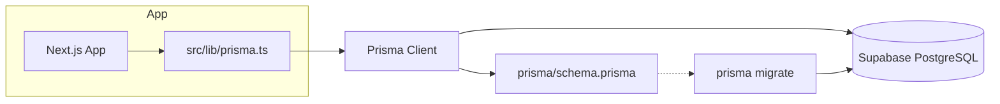
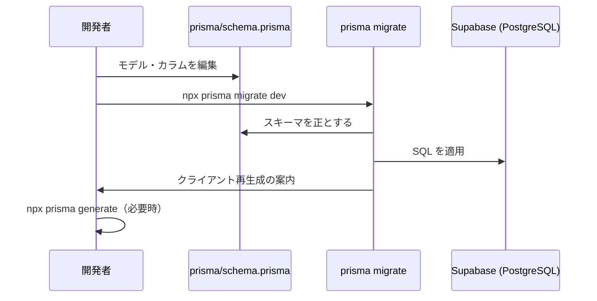

# DBツール（Prisma + Supabase）セットアップ計画

## 概要

.cursorrules で定めた Tech Stack（Database: Supabase / PostgreSQL, Prisma ORM）に従い、現状不足しているDBツールを導入するための計画です。仕様書駆動開発の前提として、DB構造は `prisma/schema.prisma` を正とし、生SQLは書かず Prisma 経由で操作します。

## 現状のプロジェクト状態

| 項目 | 状態 |
|------|------|
| Framework | ✅ Next.js 16 (App Router), React 19, TypeScript |
| Styling | ✅ Tailwind CSS v4 |
| Database (Supabase) | ❌ 未導入 |
| ORM (Prisma) | ❌ 未導入 |
| 環境変数 (.env) | ❌ なし（.env.example もなし） |
| 仕様書ディレクトリ (/specs/) | ✅ 本ドキュメントで作成 |
| Prisma スキーマ | ❌ prisma/schema.prisma なし |

**結論**: DB関連（Prisma + Supabase 接続）が未セットアップです。

---

## IPO（この計画の入力・処理・結果）

| 区分 | 内容 |
|------|------|
| **Input** | 現状の package.json、Next.js 構成、.cursorrules の Tech Stack |
| **Process** | Prisma のインストール・初期化、Supabase 用設定、クライアント生成、Next.js での利用基盤の作成 |
| **Output** | `prisma/schema.prisma` の存在、`npx prisma generate` の成功、アプリから Prisma Client を利用可能な状態 |

---

## セットアップ計画（実施順）

### Step 1: Prisma のインストールと初期化

- **作業内容**
  - `prisma` を devDependency、`@prisma/client` を dependency で追加
  - `npx prisma init` を実行し、`prisma/schema.prisma` と `.env` を生成
- **成果物**
  - `package.json` に Prisma 関連パッケージが追加される
  - `prisma/schema.prisma`（初期内容）
  - `.env`（DATABASE_URL プレースホルダー）

### Step 2: Supabase 用の Prisma 設定

- **作業内容**
  - `prisma/schema.prisma` の `datasource` を PostgreSQL にし、`env("DATABASE_URL")` を参照
  - Supabase の「接続文字列」は Project Settings → Database から取得（Direct connection / Session mode に応じて選択）
- **成果物**
  - 本番・開発ともに `DATABASE_URL` で接続できる設定

### Step 3: 環境変数まわり

- **作業内容**
  - `.env` に `DATABASE_URL="postgresql://..."` を記載（Supabase の接続文字列を貼り付け）
  - `.env.example` を追加し、`DATABASE_URL=` のみ記載（値は空またはプレースホルダー）
  - `.gitignore` に `.env` が含まれていることを確認（通常は create-next-app で含まれる）
- **成果物**
  - ローカルで DB 接続可能
  - リポジトリには `.env.example` のみコミット

### Step 4: Prisma Client の生成と Next.js での利用基盤

- **作業内容**
  - `npx prisma generate` でクライアント生成
  - `src/lib/prisma.ts` などで PrismaClient のシングルトンインスタンスを用意（Next.js の推奨パターン）
  - 必要なら `package.json` の `postinstall` に `prisma generate` を追加し、デプロイ時もクライアントが生成されるようにする
- **成果物**
  - アプリ内で `import { prisma } from '@/lib/prisma'` のように利用可能

### Step 5: 初回マイグレーション（任意・スキーマがある場合）

- **作業内容**
  - 仕様に基づき `prisma/schema.prisma` にモデルを定義
  - `npx prisma migrate dev --name init` で初回マイグレーション作成・適用
  - Supabase 上でマイグレーションが反映されていることを確認
- **成果物**
  - `prisma/migrations/` ができ、Supabase（PostgreSQL）とスキーマが一致した状態

### Step 6: 仕様駆動の前提の確認

- **作業内容**
  - 今後のDB変更は必ず `prisma/schema.prisma` を編集 → `prisma migrate dev` でマイグレーション作成
  - 生SQLは書かず、Prisma Client のみで操作することをルールとして守る
- **成果物**
  - .cursorrules の「DBのカラム名やテーブル構造は prisma/schema.prisma を正とする」が実行可能な状態

---

## Diagrams

### セットアップ後の構成（概念）

### 今後のDB変更フロー

---

## Acceptance Criteria（受入基準）

- [ ] `npm install` 後に `npx prisma generate` がエラーなく完了する
- [ ] `.env` に有効な `DATABASE_URL` を設定した状態で、`npx prisma db pull` または `npx prisma migrate dev` が接続できる（Supabase プロジェクト作成済みが前提）
- [ ] `src/lib/prisma.ts` から Prisma Client を import し、任意の API Route や Server Component で使用できる
- [ ] `.env.example` が存在し、`DATABASE_URL` の説明が分かる
- [ ] DB 構造の正は `prisma/schema.prisma` であり、生SQLでスキーマを変更しない方針が守れる状態である

---

## 補足（Supabase 側の準備）

- Supabase ダッシュボードでプロジェクトを作成
- Database → Connection string で「URI」をコピー（パスワードはプロジェクトの Database password）
- 接続プールを使う場合は「Session mode」か「Transaction mode」に応じたホスト/ポートを選択
- Prisma は通常「Direct connection」の URL を推奨（マイグレーション用）。Vercel 等では「Connection pooling」用 URL を本番用に使う場合あり

---

## 次のアクション

1. 上記 Step 1〜4 を実施し、Prisma + Supabase の「接続とクライアント利用」までを完了する。
2. 機能の仕様書（例: `/specs/01-xxx-feature.md`）でテーブル・カラムが決まったら、Step 5 で初回マイグレーションを行う。
3. 必要に応じて本計画書を「実施済み」として更新するか、別ドキュメントに実施ログを残す。
