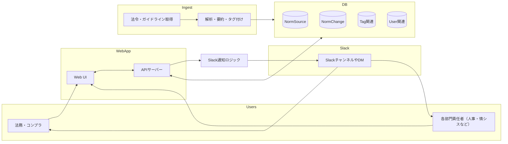
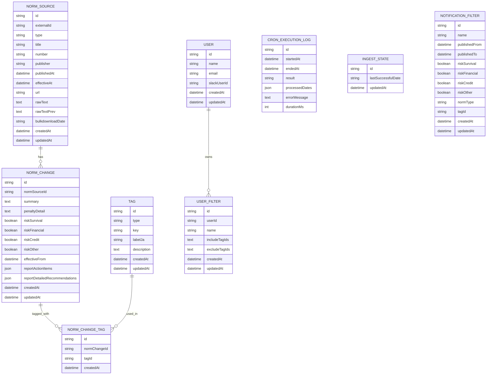
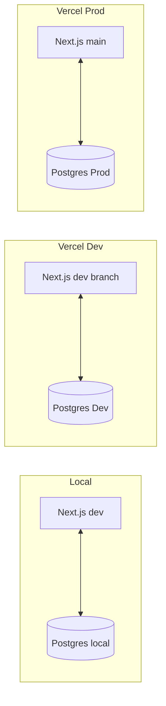

## 法令インパクト管理システム アーキテクチャ概要

このドキュメントは、法令・省令・政令・ガイドライン等の公示情報から、
「誰向けに／何がどう変わり／何をしないといけないか」を抽出・通知する
システムの全体像とデータ構造、環境構成のたたきを示します。

### 全体構成（コンテキスト図）

#### 役割の概要

- `Users`  
  - 法務・コンプラ担当、各部門責任者（人事・情シスなど）
- `WebApp`  
  - Next.js ベースの Web UI と API サーバー
- `DB`  
  - 法令原本や解析結果、タグ、ユーザー設定などの永続化
- `Ingest`  
  - e-Gov 法令 API や各省庁サイトからの取得バッチ、およびテキスト解析・タグ付けロジック
- `Slack`  
  - 関心のある法令インパクトを通知するためのチャンネル／DM

### データ構造（ER 図）

#### モデル概要

- `NormSource`
  - 法律・政令・省令・ガイドラインなど一次情報のメタデータとリンクを保持。`rawText`（改正後全文）・`rawTextPrev`（改正前全文）は bulkdownload 取得時にのみ入る。`bulkdownloadDate` は ingest 日付スコープ用
- `NormChange`
  - 実務的な「変更点」「対応が必要な論点」の単位。リスクは `riskSurvival`（業務停止・免許取消等）/ `riskFinancial`（罰金・課徴金等）/ `riskCredit`（社名公表・勧告等）/ `riskOther`（手続き変更等）の4区分。`penaltyDetail` はリスクあり時のみ設定。`reportActionItems` / `reportDetailedRecommendations` は AI 生成レポート（OpenAI）
- `Tag` / `NormChangeTag`
  - 業界・業種・機能領域・データ種別などを表す汎用タグと、その付与関係
- `User` / `UserFilter`
  - 利用者と、そのユーザーが関心を持つタグ条件（Web のフィルタや Slack 通知条件に利用）
- `CronExecutionLog`
  - ingest cron の実行ごとのログ（開始・終了・結果・処理日付一覧・エラー等を永続化）
- `IngestState`
  - ingest の進捗カーソル（1行のみ）。`lastSuccessfulDate` は「この日まで ingest と analyze 両方完了」を示し、次回 cron はその翌日から再開
- `NotificationFilter`
  - Slack 通知用フィルタ。新規 NormChange がこの条件（リスク区分・公示日範囲・種別・タグ）に一致したときのみ Slack 通知

### 環境構成案

現時点では、開発しやすさと運用負荷の軽さを優先し、以下の構成案とします。
今後の要件に応じて変更する前提の「たたき」として扱います。

#### ホスティング・ミドルウェア

- Web / API
  - Vercel 上に Next.js アプリをデプロイ
- データベース
  - Supabase（マネージド PostgreSQL）を利用
- バッチ処理（Issue #14）
  - **e-Gov ingest**: Vercel Cron で一日1回 `/api/ingest/cron` を実行（前日分の公示データを取得）。`vercel.json` の `crons` で `0 22 * * *`（毎日 22:00 UTC = 日本時間 7:00）。本番では Vercel の Environment Variables に `CRON_SECRET` を設定すること。
  - 代替: GitHub Actions の schedule や外部 cron サービスで同エンドポイントを呼ぶことも可能。

#### 環境

- ローカル
  - Next.js: `npm run dev`
  - DB: docker-compose などで PostgreSQL をローカル起動
  - Slack: 開発用 Webhook / App（検証用チャンネル）
- 開発環境（Dev）
  - Vercel: `dev` ブランチを自動デプロイ
  - Supabase: Dev 用 DB インスタンス
  - Slack: 開発用チャンネル（例: `#legal-dev`）
- 本番環境（Prod）
  - Vercel: `main` ブランチを Production としてデプロイ
  - Supabase: 本番用 DB インスタンス（バックアップ有効化）
  - Slack: 本番通知チャンネル（例: `#legal-alerts`）

#### 環境構成図

---

このドキュメントは、[Issue #2](https://github.com/bokunon/norm-changes/issues/2) で整備したアーキテクチャ共通ドキュメントです。
チケット 3 以降（Prisma スキーマ定義、バッチ実装、Web UI、Slack 連携など）の前提として参照してください。

